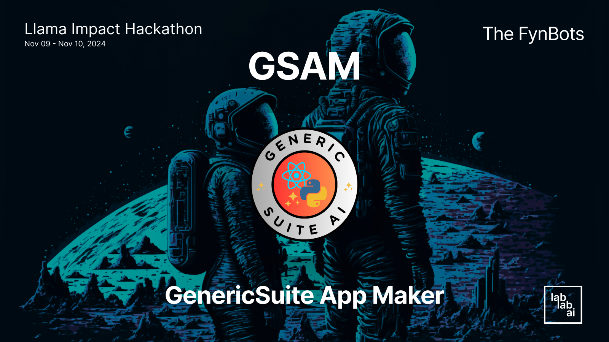

# GSAM ✨ GenericSuite App Maker

Author: [Carlos J. Ramirez](https://github.com/tomkat-cr/genericsuite-app-maker)

AI tool to enhance the software development ideation and AI models, providers and features selection and test.

<!--  -->

## Introduction

[GSAM](https://gsam-app.streamlit.app) is a tool to help on the software development process for any Application. It allows to generate code, images, video or answers from a text prompt, and kick start code to be used with the [GenericSuite](https://genericsuite.carlosjramirez.com) library.

## GSAM Python FastAPI agent

The [GSAM Python FastAPI agent](./gsam_ottomator_agent/README.md) is the implementation compatible with the [OTTomator](https://ottomator.ai) [Live Agent Studio](https://studio.ottomator.ai). For more information, see the [GSAM Python FastAPI agent](./gsam_ottomator_agent/README.md) documentation.

## Key Features

* Answer question with LLM inference, using Meta Llama models, Together.ai, HuggingFace, Groq, Ollama, Nvidia NIMs, and OpenAI.
* Image Generation: using HuggingFace and the Flux or OpenAI Dall-E models.
* Video Generation: using Rhymes AI Allegro model.
* Galleries to show the generated images and videos.
* Ability to change the Provider and Model used for all the LLM Inferences, image and video generations.
* Suggestions to generate App ideas, and the hability to customize the suggestion generation prompt.
* Code Generation: suggest the JSON configuration files and Langchain Tools Python code from an App description to be used with the [GenericSuite](https://genericsuite.carlosjramirez.com) library.
* Use LlamaIndex to generate code and JSON files using vectorized data instead of send all the attachments to the LLM.
* Store each user interaction (question, answer, image, video, code) in a MongoDB database, and retrieve it later.
* Database Management: import and export data from MongoDB to JSON files.
* Prompt Engineering: there's an option to allow the prompts/questions optimization to take more advantage from the Model's capabilities.
* Naming: generate name ideas for the App.
* App Structure: generate the App description and database table structures.
* App Presentation: generate PowerPoint presentation for the App, including the content, speaker notes, and image generation prompts.

## Technology Used

* Meta Llama models: Llama 3.2 3B, Llama 3.1 8B, 70B, and 405B
* Together.ai
* Huggingface Inference API
* Flux.1 image generation model
* Rhymes Allegro video generation model
* LlamaIndex framework.
* StreamLit
* MongoDB Atlas
* Python 3.10


## Getting Started

### Prerequisites

- [Python](https://www.python.org/downloads/) 3.10 or higher
- [Git](https://www.atlassian.com/git/tutorials/install-git)
- Make: [Mac](https://formulae.brew.sh/formula/make) | [Windows](https://stackoverflow.com/questions/32127524/how-to-install-and-use-make-in-windows)

### Installation

Clone the repository:
```bash
git clone https://github.com/tomkat-cr/genericsuite-app-maker.git
```

Navigate to the project directory:

```bash
cd genericsuite-app-maker
```

### Create the .env file

Create a `.env` file in the root directory of the project:

```bash
# You can copy the .env.example file in the root directory of the project
cp .env.example .env
```

The `.env` file should have the following content:

```bash
PYTHON_VERSION=3.10
#
# AI Parameters
#
# OpenAI
OPENAI_API_KEY=
# HuggingFace
HUGGINGFACE_API_KEY=
# Together AI
TOGETHER_AI_API_KEY=
# AI/ML API
AIMLAPI_API_KEY=
# Groq
GROQ_API_KEY=
# X AI
XAI_API_KEY=
# RHYMES parameters
RHYMES_ALLEGRO_API_KEY=
RHYMES_ARIA_API_KEY=
# Ollama
#OLLAMA_BASE_URL=localhost:11434
# Nvidia
NVIDIA_API_KEY=
#
# Database Parameters
#
DB_TYPE=mongodb
# DB_TYPE=json
#
# MongoDB database parameters
MONGODB_URI=mongodb+srv://<user>:<password>@<cluster>.mongodb.net
MONGODB_DB_NAME=gsam_db
MONGODB_COLLECTION_NAME=conversations
#
# JSON database parameters
# JSON_DB_PATH=./db/conversations.json
```

Replace the `..._API_KEY` access tokens with your Together.ai, OpenAI, Huggingface, Groq, Nvidia, and Rhymes API keys, respectively.

The API Keys specified in the `.env` file will enable the the corresponding LLMs, image generators, and video generators to be available in the Model Selection panel.

To use a MongoDB database, comment out `DB_TYPE=json`, uncomment `# DB_TYPE=mongodb`, and replace `YOUR_MONGODB_URI`, `YOUR_MONGODB_DB_NAME`, and `YOUR_MONGODB_COLLECTION_NAME` with your actual MongoDB URI, database name, and collection name, respectively.

### Run the Application

```bash
# With Make
make run
```

```bash
# Without Make
sh scripts/run_app.sh run
```

## Usage

Go to your favorite Browser and open the URL provided by the application.

* Locally:<BR/>
  [http://localhost:8501](http://localhost:8501)

* Official App:<BR/>
  [https://gsam-app.streamlit.app/](https://gsam-app.streamlit.app/)

### Prompt Suggestions

- The Prompt Suggestions under the title can be generated from AI using the `Suggestions Prompt` pull-down section. Enter the Prompt in the text box and click the `Generate Suggestions` button. Click on `Reset Prompt` to set the default prompt.
- Any suggestion text can be copied to the Question box by clicking on it.

### Models Selection

- The LLM Chat, Image and Video generarion Providers and Models can be selected using the `Models Selection` pull-down section.

### Text-to-Text Generation

* Enter your text prompt in the provided text box or select one of the suggested prompts.
* Check the `Enhance prompt` checkbox to allow the LLM to optimize the prompt to take more advantage from the Model's capabilities.
* Select the `Main` tab and click the `Answer Question` button.
* The answer will appear in below the queston box.
* Click the `Use Response as Prompt` button to use the answer as the prompt for the next question.
* All questions and answers are available in the side menu.

### Text-to-Image Generation

* Enter your text prompt in the provided text box or select one of the suggested prompts.
* Check the `Enhance prompt` checkbox to allow the LLM to optimize the prompt.
* Select the `Main` tab and click the `Generate Image` button.
* Sit back and watch as [GSAM](https://gsam-app.streamlit.app) transforms your text into a high-quality image.
* After a few seconds, the image will appear.
* All images are available in the side menu and can be viewed in the gallery clicking the `Image Gallery` button.

### Text-to-Video Generation

* Enter your text prompt in the provided text box or select one of the suggested prompts.
* Check the `Enhance prompt` checkbox to allow the LLM to optimize the prompt.
* Select the `Main` tab and click the `Generate Video` button.
* Sit back and watch as [GSAM](https://gsam-app.streamlit.app) transforms your text into a high-quality video.
* After 2+ minutes, the video will appear in the video container.
* All videos are available in the side menu and can be viewed in the gallery clicking the `Video Gallery` button.

### App ideation

Click the `App ideation` tab to have access to the app ideation page. This page allows you to specify the application name, description, and other elements to generate naing ideas, app extended description and database structure, and presentation.

* **Generate App Names**: In the Application Ideation Form section, fill in the required fields (Application name, Subtitle, Summary and App Type) and click the `Generate App Names` button at the bottom to generate ideas on how to name you application.

* **Generate App Structure**: In the Application Ideation Form section, fill in the required fields (Application name, Subtitle, Summary and App Type) and click the `Generate App Structure` button at the bottom to generate ideas on how to descroibe and structure your application.

* **Generate Presentation**: In the Application Ideation Form section, fill in the all the form fields and click the `Generate Presentation` button at the bottom to generate the slides structure and create the PowerPoint file.

### Code Generation

This option allows the JSON configuration files and Langchain Tools Python code generation from an App description to be used with the [GenericSuite](https://genericsuite.carlosjramirez.com) library.

* Enter your text prompt in the provided text box or select one of the suggested prompts.
* Check the `Use Embeddings` checkbox to use LlamaIndex in the code and JSON files generate, using vectorized data instead of send all the attachments to the LLM.
* Check the `Enhance prompt` checkbox to allow the LLM to optimize the prompt.
* Select the `Code Generation` tab and click the `Generate Config & Tools Code` button.
* Sit back and watch as [GSAM](https://gsam-app.streamlit.app) transforms your text into a high-quality code.
* After a few seconds, the code will appear in the code container.

### Notes

- Each entry in the side menu has an `x` button to delete it.
- Depending on the `DB_TYPE` parameter, the side menu items are stored in MongoDB or in a JSON file localted in the `db` folder.
- You can add additional LLM / Image / Video providers and models in the [./config/app_config.json](./config/app_config.json) file, as well as configure all other GSAM parameters.
- All the system prompts used by GSAM are located in the [./config](./config) directory.

## Screenshots

Main Page


LLM Inference


Suggestions Generation & Model Selection


Suggestion Applied to Prompt


Code Generation


App Ideation Page [1]


App Ideation Page [2]


Presentation Generation


Image Generation


Image Gallery


Video Gallery


## Contributors

[Carlos J. Ramirez](https://www.linkedin.com/in/carlosjramirez/)

Please feel free to suggest improvements, report bugs, or make a contribution to the code.

## License

This project is licensed under the terms of the MIT license. See the [LICENSE](LICENSE) file for details.

## Acknowledgements

* [Meta](https://www.llama.com/) for developing the Meta Llama powerful models.
* [Streamlit](https://streamlit.io/) for providing a user-friendly interface for interacting with the application.
* Open-source community for inspiring and supporting collaborative innovation.
* Users and contributors for their feedback and support.

## Credits

This project is developed and maintained by [Carlos J. Ramirez](https://www.linkedin.com/in/carlosjramirez/). For more information or to contribute to the project, visit [GenericSuite App Maker on GitHub](https://github.com/tomkat-cr/genericsuite-app-maker).

Happy Coding!

## Contributing

This agent is part of the oTTomator agents collection. For contributions or issues, please refer to the main repository guidelines.
