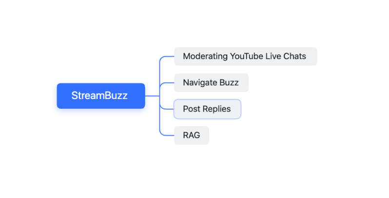
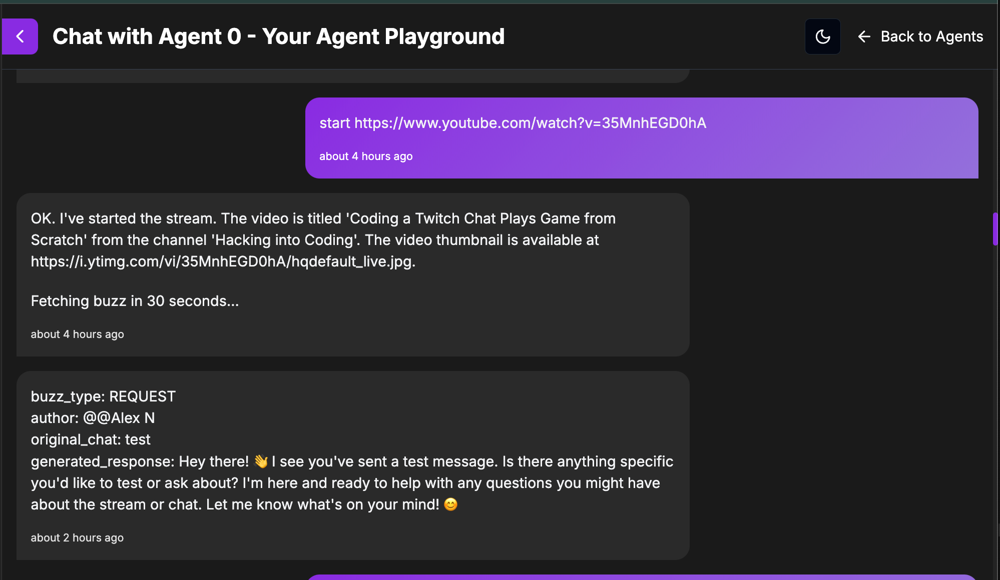
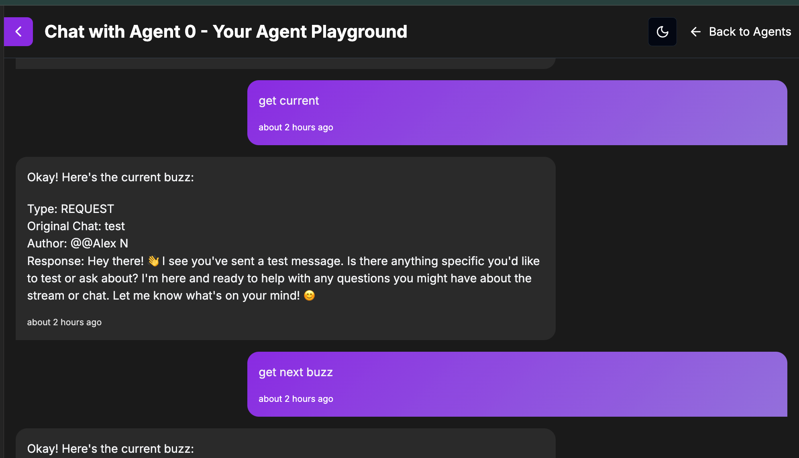
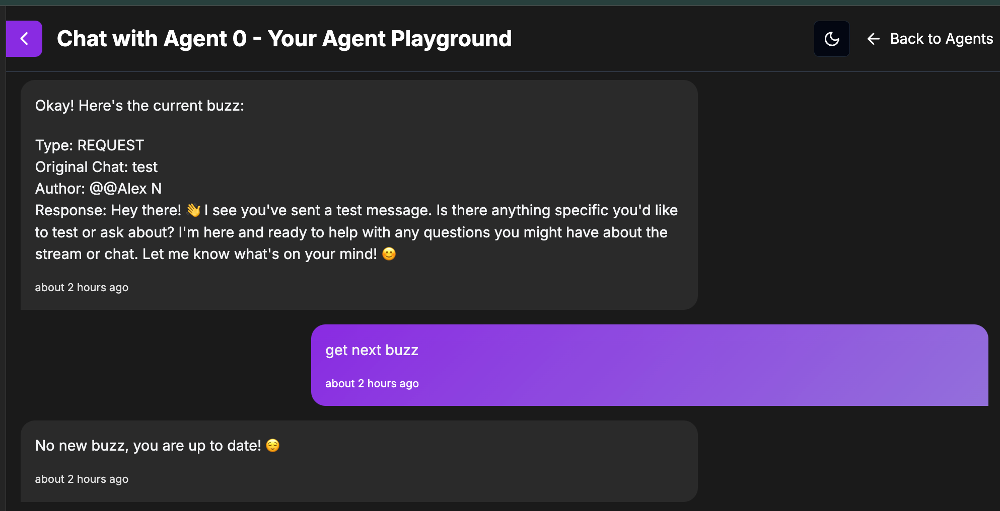
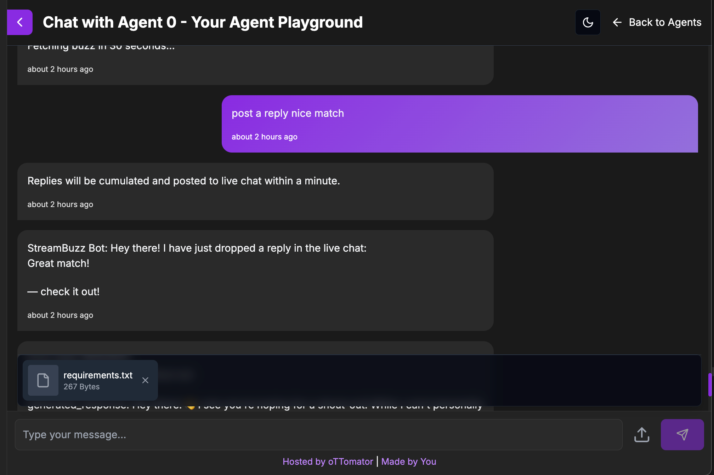
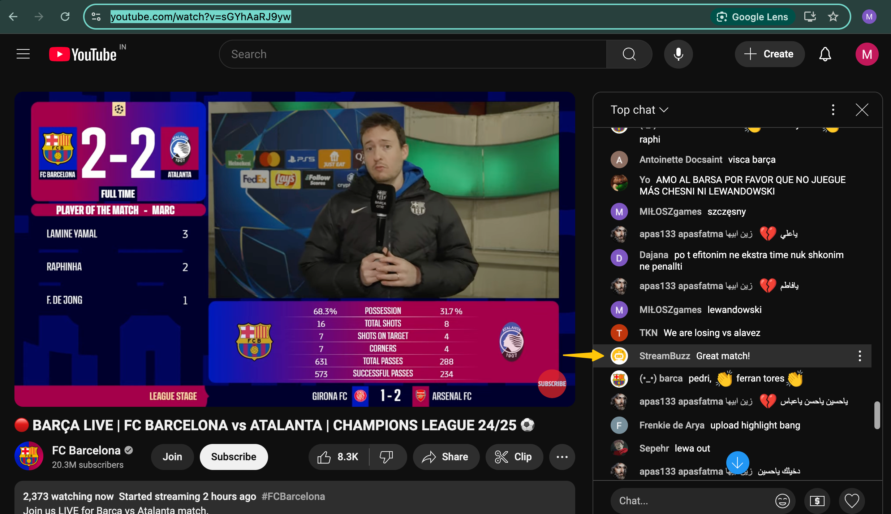
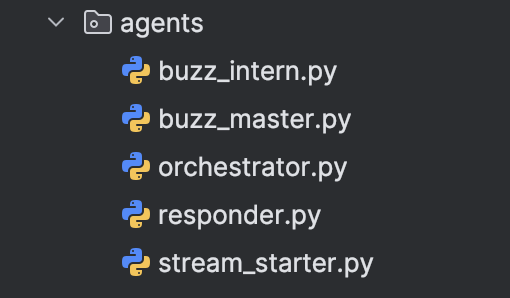

# StreamBuzz 🚀

Author: [Mohammed Hammaad](https://github.com/hammaadworks)

## **Index**

1. [Intro](#your-ai-powered-youtube-live-stream-chat-moderator)
2. [Why StreamBuzz?](#why-streambuzz)
   - [The Solution](#the-solution)
   - [Usage](#usage)
   - [Benefits](#benefits)
   - [Features](#features)
3. [Getting Started](#getting-started)
   - [Installation](#installation)
     - [Configuration](#configuration)
     - [Running StreamBuzz](#running-streambuzz)
4. [Demo & Architecture](#demo--architecture)
   - [Demo Gallery](#demo-gallery)
     - [Images](#images)
     - [Videos](#videos)
     - [Architecture Diagrams](#architecture-diagrams)
5. [Project Nuances and Future Scope](#project-nuances-and-future-scope)
   - [Current Limitations](#current-limitations)
   - [Future Scope](#future-scope)
6. [Acknowledgments](#acknowledgments-)

---

## **Your AI-powered YouTube Live Stream Chat Moderator**

**Attention Streamers!!**

Tired of drowning in a tsunami of chat messages while trying to present to your audience? StreamBuzz to the rescue! This AI sidekick filters key messages, handles FAQs, and posts replies—so you can focus on being the rockstar streamer you were born to be.

---

## **Why StreamBuzz?**

Live streaming is booming, with over **2 billion monthly YouTube users**. Streamers educate, entertain, and engage, but juggling an avalanche of chat messages **while presenting** is like trying to play chess on a roller coaster. 🎢 Important questions, concerns, and requests get lost in the flood, making chat management feel impossible.

### **The Solution**

StreamBuzz **filters the noise, highlights key messages, and automates replies**, so you can engage without stress. No more hunting through chat chaos—just smooth sailing! ⛵

<p align="center">
  
</p>
<p align="center"><b>StreamBuzz Feature Map</b>
</p>

<p align="center">
  
</p>
<p align="center"><b>StreamBuzz Live!</b><em>WIP: Updating soon!</em></p>

---

### **Usage**

1. Go to Live Agent Studio to try [StreamBuzz]()
2. Pick a YouTube Live Stream, and chat to get started.
3. StreamBuzz filters and prioritizes chat messages (buzz) in the background. 
   - StreamBuzz intelligently processes multilingual chats, too.
4. Navigate through the **real-time buzz list** using natural language.
   - With sentences like, `get current buzz` or `get next buzz`.
5. Post replies **directly from the chat interface**—error-free and neatly summarized.
   - StreamBuzz background worker takes care of correcting typos, summarizing and posting your replies.
6. Upload a text file to build a knowledge base and supercharge your responses. ⚡

All in all, StreamBuzz is the ultimate **companion and chat moderator** for YouTube Live Streamers. Think of it as your chat butler. ☕

Note, for the Live Agent Studio, the transformers package had to be removed because it made the container way too large. User message classification has
been configured in a slightly different way that might not be as powerful as the original implementation but the agent still functions the same!

---

### **Benefits**

**🎯 Focus on Content** – Let StreamBuzz handle chat while you do your thing.\
**🔍 Better Engagement** – Important questions, concerns, and requests **stand out**.\
**⏳ Saves Time** – Generates replies for buzz (important messages), reducing your mental load.\
**🛠️ Customizable** – Update your knowledge base, and StreamBuzz **adapts automatically**.\
**💬 Improves Viewer Experience** – Ensures timely, relevant, typo-free responses.

---

### **Features**

🔹 **AI Chat Moderation** – Extracts key messages (buzz) from an ocean of chat spam. Navigate buzz at your own pace.\
🔹 **Suggested Replies** – Auto-generates responses and allows customization via a text-based knowledge base.\
🔹 **RAG (Retrieval-Augmented Generation)** – Smarter responses for streamers and chat queries.\
🔹 **Seamless YouTube Integration** – Works directly with YouTube Live Chat **in real time**.

---

## **Getting Started**

### **Installation**

```bash
# Clone the repository
git clone https://github.com/hammaadworks/streambuzz.git
cd streambuzz

# Create a virtual environment (optional)
python -m venv .venv
source ./.venv/bin/activate

# Install dependencies
pip install -Ur requirements.txt
```


### **Configuration**

1. Fill in your keys as specified in the `.env.example` file. 
   - Use your model of choice by changing variables in `constants.py` under model section.
   - Paste your YouTube credentials in `.env` file as specified in `.env.example` file.
    **Note: Hackathon organisers, kindly contact me at hammaadworks@gmail.com for YouTube Credentials to get the project started**
2. Create database tables using the DDL commands provided in `queries.sql` file.
3. Set up the user interface using **Agent 0 by Ottomator.ai** ([Agent 0](https://studio.ottomator.ai/agent/0)).


### **Running StreamBuzz**
1. Set Environment Variable in `.env` file

    ```bash
    # Copy .env.example to .env and set your keys in .env file
    cp .env.example .env
    ```

2. Serve the FastAPI app

    ```bash
    fastapi-cli dev streambuzz.py --port 8001 --reload
    ```

    Alternatively, you can use `uvicorn`:

    ```bash
    uvicorn streambuzz:app --host 0.0.0.0 --port 8001
    ```

---

## **Demo & Architecture**

### **Demo Gallery**

#### **Experience StreamBuzz in Action!**

<p align="center">
  <a href="https://www.youtube.com/watch?v=YOUR_VIDEO_ID">
    
  </a>
</p>

<p align="center"><b>Click the thumbnail to watch the demo on YouTube! 🚀</b></p>

*WIP: Uploading to YouTube in progress, Updating this asap!! Stay tuned :)*

#### **Images**

<p align="center">
  
</p>
<p align="center"><b>1. Start chat moderation with ease.</b></p>


<p align="center">
  
</p>
<p align="center"><b>2. Navigate through chat messages effortlessly.</b></p>


<p align="center">
  
</p>
<p align="center"><b>3. Stay up to date with all key chats. 🎉</b></p>


<p align="center">
  
</p>
<p align="center"><b>4. Seamless reply integration with YouTube Live Chat.</b></p>


<p align="center">
  
</p>
<p align="center"><b>5. Replies posted within a timeframe of 60 seconds on YouTube Live Chat.</b>
</p>

#### Videos

<p align="center">
  <a href="https://www.youtube.com/watch?v=TPPxOZ4SpSk">
    
  </a>
</p>

<p align="center"><b>StreamBuzz RAG Demo</b></p>

### **Architecture Diagrams**

<p align="center">
  
</p>
<p align="center"><b>A Moderator Crew of 5 Agents to your rescue!</b></p>

*WIP: Proofreading in progress, Updating this asap!! Stay tuned :)*

---

## Project Nuances and Future Scope

### Current Limitations
1. **OAuth Support**  
   - Currently unavailable. Implementing OAuth support would allow replies to be posted on behalf of the streamer using their Google account.

2. **One Stream per Chat Session**  
   - Only one stream can be moderated per chat session.  
   - If a request to moderate another stream is made, the previous stream is deactivated, and a new session is initiated.

3. **Post-Stream Replies**  
   - Replies cannot be posted after a YouTube stream ends.  
   - However, unviewed buzz will remain accessible for review.

4. **Buzz Navigation**  
   - Navigation through previous buzz is not supported; only forward navigation is possible.

5. **Single File RAG Support**  
   - Only one text file can be uploaded per chat session.  
   - Uploading a new file deletes the knowledge base from the previous file. Enhancements can be made to support multiple files of various formats.

### Future Scope
- **OAuth Integration**: Enable seamless posting of replies using the streamer’s Google account.
- **Multi-Stream Moderation**: Allow moderation of multiple streams in a single session without resetting.
- **Post-Stream Interaction**: Extend functionality to post replies even after the stream has ended.
- **Enhanced Buzz Navigation**: Implement backward navigation for buzz messages.
- **Multi-File Support**: Develop features to handle multiple files of various formats within a single session.

---

## **Acknowledgments**  

StreamBuzz was created as part of the **oTTomator Live Agent Studio Hackathon**.  
Huge shoutout to [**Cole Medin**](https://github.com/coleam00) and the [**Ottomator AI Team**](https://studio.ottomator.ai/)  
for hosting this incredible event and pushing the boundaries of AI-powered automation! 🎉  

A massive thank you to the **open-source community** for their contributions, making cutting-edge technology accessible to all.  
Special appreciation for projects like **[Pydantic AI](https://ai.pydantic.dev/)** and others, 
your work makes innovations like StreamBuzz possible!  

To all **content creators** who educate, share knowledge, and make resources more accessible—you are shaping the future!  
Special mentions go to:  

- 🎥 [**Cole Medin**](https://www.youtube.com/@ColeMedin) – Breaking down AI, automation, and building cool stuff.  
- 🎥 [**Your Tech Bud Codes**](https://www.youtube.com/@YourTechBudCodes) – Making tech & coding easier for everyone.  

---

### **Special Thanks to the Global Streamer Community** 🎙️✨  

Most importantly, **a heartfelt thanks to the global streamer community**—the educators, entertainers, and innovators  
who make live streaming a hub of knowledge and engagement.  

You inspire us to build tools that make your work easier and your content even better.  
**This is for you!** 🚀

## Contributing

This agent is part of the oTTomator agents collection. For contributions or issues, please refer to the main repository guidelines.

