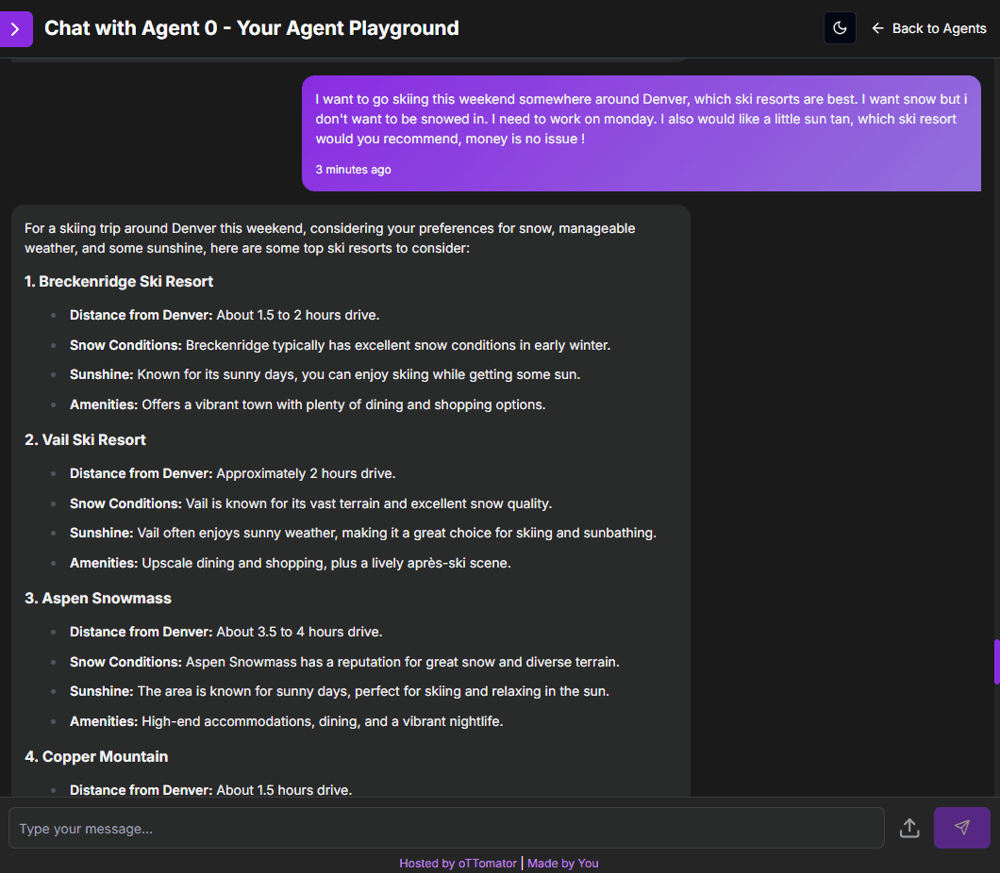
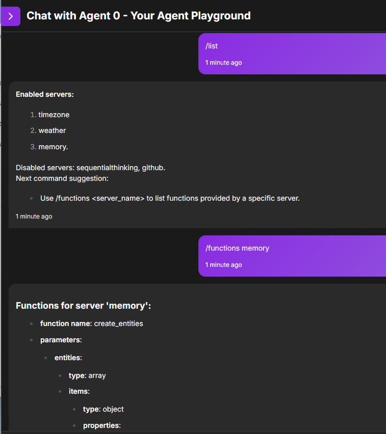

# ThirdBrAIn MCP OpenAI agent

Author: [ThirdBrAIn.tech](https://github.com/cbruyndoncx)

This agent created for the oTTomator hackathon makes the LiveAgentStudio work in similar ways to Claude Desktop but for OpenAI compatible models.

This agent makes mcp tools accessible to openai compatible llms (chat completions).
This enables the use of MCP servers across a much wider range of models such as:
- evidently OpenAI such as GPT-4o-mini, GPT-4o
- deepseek-chat (currently v3) , at this point deepseek-r1 does not support function calling.
- ollama with deepseek variants (not tested yet).

> MCP makes it possible to centralize resources (RAG), prompts and tools and use the same code across platforms. 
> It is an extreme DRY concept for distributed agentic systems that hides the implementation details. 
> For more information see https://modelcontextprotocol.org

## Demo
### Planning for skiweekend
The agent has built-in python code for weather forecast service for US. 
I asked where to go skiing around Denver next weekend and did some follow-up calls to get exact weather conditions and a comparison between ski resorts demonstrating iterative tool calling until the weather forecast for each ski resort is obtained and recommendations made.


## Installation
If you are unfamiliar with the hackathon agents, follow the detailed installation instructions provided for the hackathon.
[LiveAgentStudio_README.md]

### Specifics for the MCP OpenAI agent
This agent has uses or has been tested with:
- Python 3.12
- pip
- Supabase
- OpenAI API Key, or Deepseek API key, or no key if using Ollama
- Appropriate runtime environment for the mcp server commands you want to use such as
  - Docker
  - Node / npx
  - Uv / uvx
  - Python3 

> Note:
> Anthropic and Docker have published servers that are easy to install.
> PulseMCP website has the most comprehensive collection of MCP servers.

### .env 
Rename the env example file 
`mv .env.example .env`

Use your favourite editor (mine is **micro** - like nano but with mouse support and sensible keybindings) and update .env 

### mcp_config.json default setup
The `mcp_config.json` file contains the default configurations for MCP servers. Each server configuration includes the command to execute, arguments, and optional environment variables. This file is essential for the MCP agent to know how to interact with different servers.
An enable option has been added to be more flexible once running.

Example default setup:
```json
{
    "memory": {
        "command": "docker",
        "args": ["run", "-i", "--rm", "mcp/memory"],
        "env": {},
        "enable" : true
    },
    "compute": {
        "command": "docker",
        "args": ["run", "-i", "--rm", "mcp/compute"],
        "env": {},
        "enable" : false
    }
}
```

## Usage

### Run the agent

This launches the agent ready to be called by oTTomator chatbot

```bash
uvicorn thirdbrain-mcp-openai-agent:app --host 0.0.0.0 --port 8001
```
You can check if the agent is running by navigating with your browser to
```http://localhost:8001/api/thirdbrain-hello```

### Run standalone MCP Client from CLI

With the standalone mcp_client file, you can test the workings of the MCP client without oTTomator. 
They each have their own specific startup code, but the core library is the same. mcp_client.py functions are called from the agent.

```bash
python mcp_client.py
```

### Slash commands within the chatbot (agent and cli)

The management of the mcp_config.json file is done through slash commands. We want this to be really deterministic when managing the configuration.




#### /list
Lists all enabled and disabled mcp servers known on the system

#### /functions <server-name>
Lists all the functions with their signature for the particular mcp server

#### /addMcpServer {servername: { command: X , args: [], env: {} }}
This command allows you to add a new MCP server configuration. The configuration should be in valid JSON format and will be saved in the `mcp_config.json` file. The `command` specifies the executable to run, `args` is an array of arguments for the command, and `env` is an optional object for environment variables.

Example:
```/addMcpServer {"memory": {"command": "docker", "args": ["run", "-i", "--rm", "mcp/memory"]}}```

> Note beginning and ending curly braces. Typically 2 unless you also have a "env": {} section

#### /disable [server-name, ...]
This command disables one or more specified MCP servers. Provide the server names as a comma-separated list.

Example:
```/disable server1, server2```

#### /enable [server-name, ...]
This command enables one or more specified MCP servers. Provide the server names as a comma-separated list.

Example:
```/enable server1, server2```

#### /dropMcpServer [server-name, ...]
This command removes an existing MCP server configuration. Provide the server name you wish to remove.

Example:
```/dropMcpServer server1```


## FAQ
1. **Why SELECTED in .env ?**: This gives more flexibility to test and support additional OpenAI compatible models without needing code changes
2. **Will you use pydantic-ai in the future ?**: Looking at the discussions for the Agent rewrite, depending on how strict the response validations are, this might be feasible or not. A lot of functionality is hidden under the Pydantic-AI hood.
3. **Why no setup for openrouter and others ?**: spent too much time trying to figure out why Pydantic AI wouldn't work with OpenAI that I did not test with extra intermediaries. Only when the OpenAI worked well, i started testing with deepseek-chat for real cheap solution. If other models are truely openai compatible than it should/would work

Author originally created a section outlining some bugs with Pydantic AI to explain why it isn't used here. That has been removed to keep this README from going stale quick.

## Contributing

This agent is part of the oTTomator agents collection. For contributions or issues, please refer to the main repository guidelines.