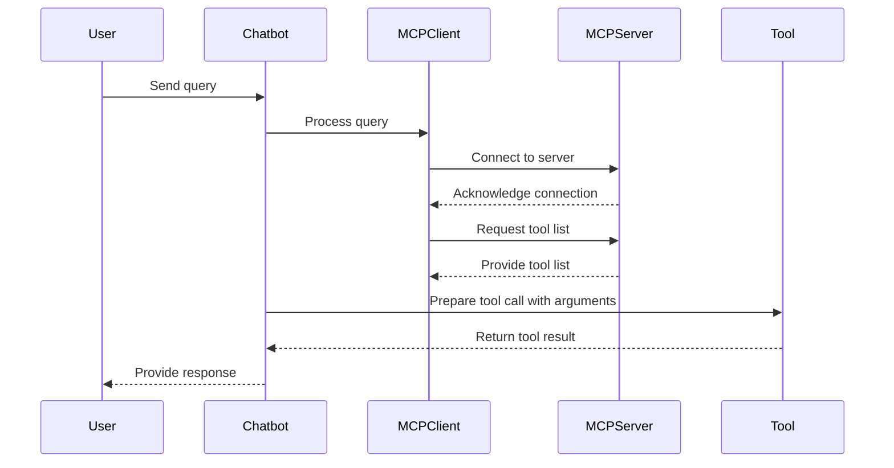

# Tool Calling Sequence Diagram

This document provides a sequence diagram that illustrates the process of tool calling in the system, highlighting the role of the chatbot in preparing the tool call.

### Updated Sequence Diagram for Tool Calling Sequence

### Explanation

- **User Interaction:** The user sends a query to the chatbot.
- **Chatbot Processing:** The chatbot processes the query and interacts with the `MCPClient` to manage server connections and tool interactions.
- **MCPClient and MCPServer Interaction:** The `MCPClient` connects to the MCP server, requests the tool list, and receives the available tools.
- **Tool Preparation:** The chatbot prepares the tool call with the necessary arguments and invokes the tool.
- **Tool Execution:** The tool executes the requested operation and returns the result to the chatbot.
- **Response to User:** The chatbot provides the final response to the user, incorporating the tool's result.
